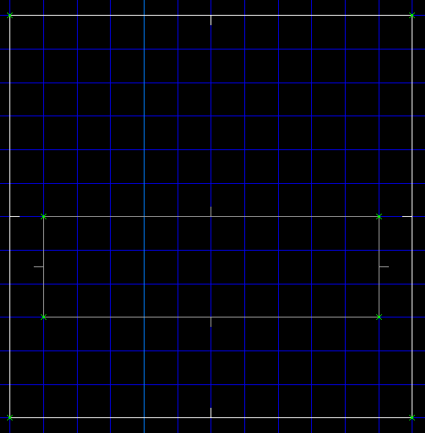
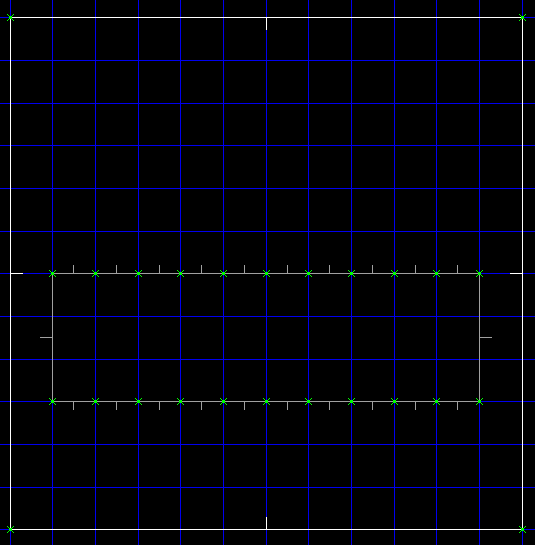
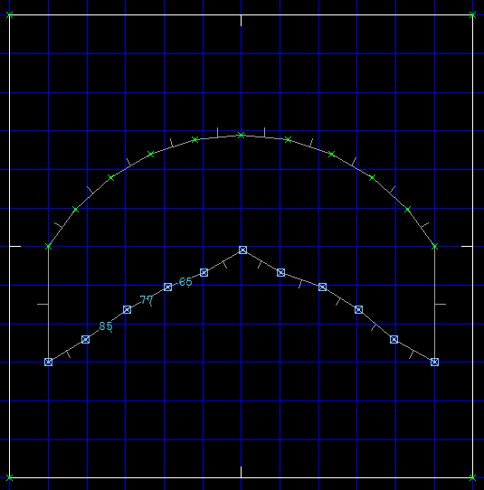
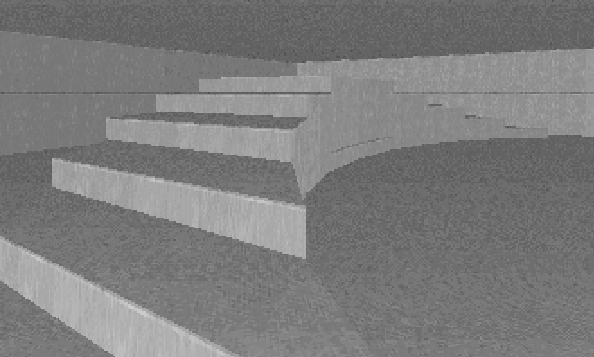
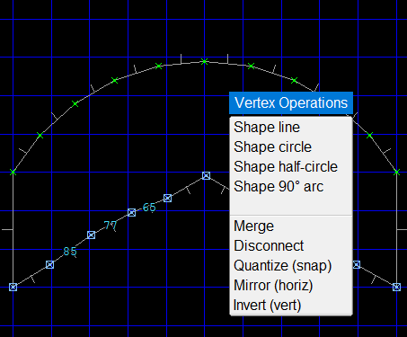

# Curved Stairs

## Layout

## Method

Draw the outline of the stairs in vertex edit mode:

Use the `LMB` to insert vertices along the edges, to define where the steps will be:

Press `f` to toggle free mode (no grid snapping) and drag the step vertices *roughly* into the arc shape.

Deselect all vertices (`` ` ``) and only select those on one side of the stairs:

Press `SHIFT`-`c` (shape arc to 120 degrees):

Now deselect all vertices, select only the other side and apply the shape arc operation again. Next use the `RMB` to join the step vertices:

Switch to sector edit mode, hold `SHIFT` and drag-select the stair sectors:

Press the raise floor shortcut (`.`) twice. Using the `LMB`, deselect the left-most step, and deselect the right-most step:

Repeat raising the floor and deselecting a step from either side, until you reach the center step. Your stairs are now done:

## Notes

The shape arc operation is also available by pressing `F1` to bring up the operations menu. However this menu does not have the 120 degree arc, so we used the `SHIFT`-`c` keyboard shortcut.

## Downloads
[curved-stairs.wad](http://sourceforge.net/projects/eureka-editor/files/Misc/Samples/curved-stairs.wad/download)
