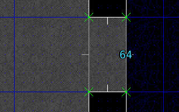
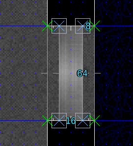
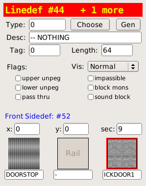
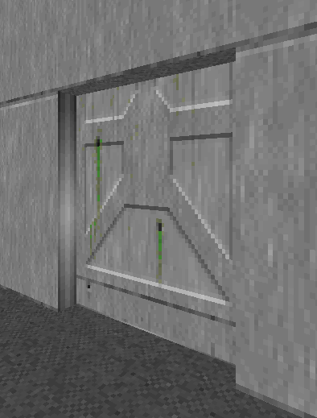
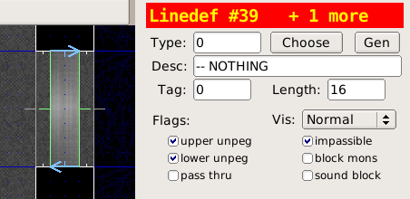
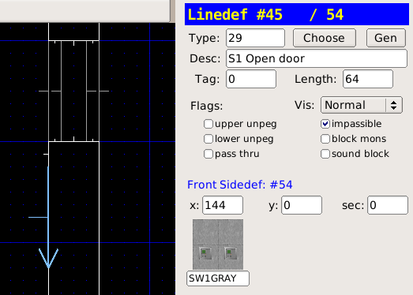
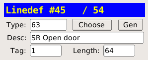
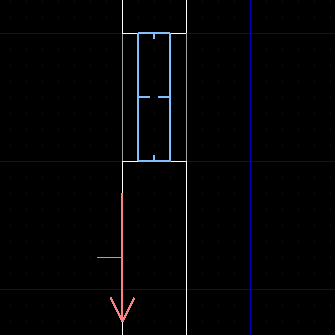

# Doors

Manual, remote and locked doors.

> **Note:**
>
> Door textures come in two sizes: 64 and 128. When making your doorway, opt for a passage width to match.

## Building a door
Use this method to make a basic door. It can be used as a base for a manual or a remote door.

* Join two sectors together with a passage

* Increase the grid detail as needed by pressing `3`..`5`
* Enter vertices edit mode (`v`)
* Add vertices for the door inside the passage

* Enter linedef edit mode (`l`) and select the front/rear sides of the door

* The door raises into the ceiling, set the front upper sidedef texture to the ICKDOOR1 texture.

* Enter sector edit mode (`s`) and select the door sector

* Lower the ceiling all the way to the floor so that the door is closed. Use the **Ceiling** +- buttons or the `[` `]` keys.

## Manual Doors
Manual doors open when the player performs the USE action on the door.

* Enter linedef edit mode (`l`)
* Select both linedefs of the door

* Choose the **Type** of the linedefs as 1 DR Open Door

To make the door open on a fixed track (the sides stay still while opening and closing):

* Select the track linedefs
* Check the **upper unpeg** and **lower unpeg** options

> **Note:**
>
> The door line specials indicates that the sector facing the back of the linedef is a door, this special does not need a tag either.
>
> The DR special can be opened repeatedly, while D1 can only be opened once.

## Locked Doors
Doors that require a blue, yellow or red key to open are created similarly to manual doors. When choosing the door linedef type, pick one of the specials that target the keys:

## Remote Doors
Remote doors are opened through a switch.

* Enter vertice edit mode (`v`)
* Use the `LMB` to insert vertices along the wall, make the linedef 64 units long

* Enter linedef edit mode (`l`), select the new linedef
* Choose the SW1GRAY switch texture

* Choose the linedef **Type** as 63 SR Door Open
* Move the mouse cursor over the grid to ensure focus is not stolen by the **Line Specials** panel
* Press `;` then `f` to apply a fresh tag to the linedef

* Enter sector edit mode (`s`), select the door sector

* Press `;` then `l` to apply the last tag to the door sector

* Eureka highlights both the sector and the linedef that share the same tag. This shows us the two are linked:

> **Note:**
>
> The SR line special indicates a switch that can be toggled repeatedly, while S1 is a switch that can only be toggled once.

## Downloads

[doors.wad](http://sourceforge.net/projects/eureka-editor/files/Misc/Samples/doors.wad/download)
