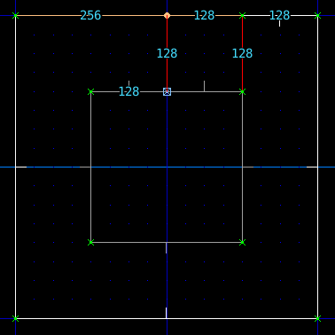
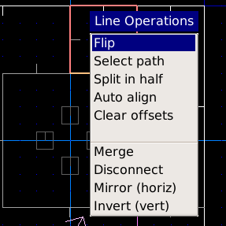
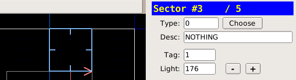

[back to the Index](User_Index.html)   |   [go to next page](Cookbook_ToxicPool.html)

Lifts
=====

Method
------

*   Enter vertex edit mode and create the lift platform. This can be a simple split of a raised sector:

*   Ensure the linedef on the front of the lift is facing outward. A lift is triggered from the **Front** linedef.
*   If the linedef is facing the wrong way, you can select it and press F1 for the operations menu, and select \`Flip\`:

*   Enter linedef edit mode, select the front of the lift

*   Choose the **Type** as 62 SR Lower Lift
*   Press ; then f to apply a fresh tag to the linedef

*   Enter sector edit mode (s), select the lift sector
*   Press ; then l to apply the last tag to the sector

> **Note:**
>
> The SR line special indicates Switch Repeating, so the lift can be used over and over.

Downloads
---------

[lifts.wad](http://sourceforge.net/projects/eureka-editor/files/Misc/Samples/lifts.wad/download)

[back to the Index](User_Index.html)   |   [go to next page](Cookbook_ToxicPool.html)